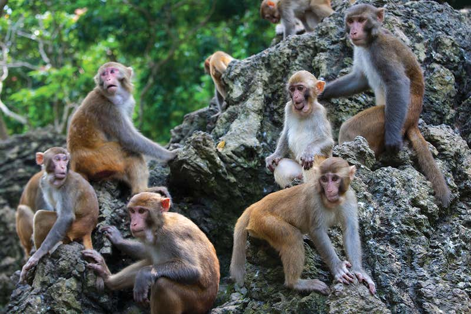

  

photo credit: TAO Photography

# Agonism and grooming behavior explain social status effects on physiology and gene regulation in rhesus macaques // Simons et al. 2021

This repository contains data and code for the manuscript _Agonism and grooming behavior explain social status effects on physiology and gene regulation in rhesus macaques - in prep_
